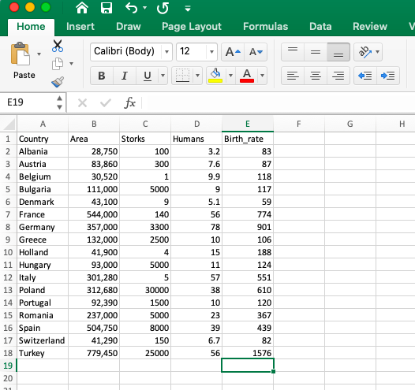

```{r setup, include=FALSE}
knitr::opts_chunk$set(echo = TRUE)
library(tidyverse)
```

## Testing the relationship between birthrates and ...

In Matthews (2000) discussion of the logical and statistical traps in correlations, he introduces a proof of the legend that babies are delivered by storks, and shows how that statement is apparently supported (at a high degree of significance) using data from European nations. 
Last week I suggested that you use this as a chance to freshen up your own R skills, and to test alternate hypothesis to determine which relationship "best" explains the inter-national variability in birth rate. 

# Transcribe the data
I used a spreadsheet to recreate the data table from Table 1 in the paper. Make sure to save it as a .csv! To make my life easier, I made sure that the column headers didn't have any spaces, and were short and easy to type. 

 

# Import the data
```{r}
StorkData <- read_csv("data/StorkData.csv")
```

Cool! I always like to have a look at the dataset after it imports to make sure it wasn't corrupted. 

```{r}
head(StorkData)
```

# plot the dataset
That seems fine. Let's make a quick plot to see how things look.
Remember that using ggplot, you'll need to specify the dataset to use, and then the aesthetic (how the graph should look). Aes wants to know what will be on the x-axis, the y-axis, and what sort of plot you want (geom_point is a scatter plot). 
```{r}
ggplot(StorkData, aes(x=Storks, y=Birth_rate)) + geom_point()
```

Great- it worked. Now lets clean that up.
```{r}
ggplot(StorkData, aes(x=Storks, y=Birth_rate)) + 
  geom_point()+
  geom_smooth(method=lm)+
  labs(title="Birthrate as a function of stork population",
       x="Storks (pairs)", y = "Birth Rate (10^3/yr)")
```

Cool. Now, you might remember that to do a regression analysis, we need to create a linear model (using the command "lm"). lm wants its arguments in the form "y ~ x" (read: y as a function of x). 

# Make a linear model of these data
```{r}
StorkData.lm <- lm(StorkData$Birth_rate~StorkData$Storks)
```

Notice that for the y and x arguments, I've used the name-of-the dataframe$name-of-the-column. 

Let's have a look at this correlation:
```{r}
summary(StorkData.lm)
```

It does look okay. That R-squared isn't great, but p-values don't lie (or...or do they?) And hey! In the paper, Matthews talks about r, not R-squared! The summary from lm gives me two kinds of R-squared, but not r (the correlation coefficient). How can I get that? Well, it's pretty easy to just look at, say, the multiple R-squared from your summary (here it looks like 0.3874), and then take the square root. That's legit!

```{r}
sqrt(0.3847)
```

But the R statistic they are talking about, the correlation coefficient, is pretty useful, so lemme show you how to get that without digging through a linear model.There are a few kinds of coreelation coefficient calculation methods. The Pearson is standard, and I suspect that's what Matthews used. 

# Calculating correlation coefficients
```{r}
cor(StorkData$Storks,StorkData$Birth_rate, method= "pearson")
```

Looks pretty familiar.

Okay- the nice thing about walking through this is that I've proven to myself that I can reproduce the original result. Now we can use the same basic code to test other relationships- like the one between birth rate and land area. 

# The alternate hypothesis...
```{r}

# making the the linear model
StorkDataArea.lm <- lm(StorkData$Birth_rate~StorkData$Area)

#viewing the model statistics
summary(StorkDataArea.lm)

#plotting the regression (with std error)
ggplot(StorkData, aes(x=Area, y=Birth_rate)) + 
  geom_point()+
  geom_smooth(method=lm)+
  labs(title="Birthrate as a function of national area",
       x="Area (km^2)", y = "Birth Rate (10^3/yr)")
```

That makes more sense, the R-squared is much better (indicating that it explains more of the variability in the data), the p-value is even "better", and I have a better logical explanation of how this underling factor of country size might affect birthrate. Now, what about population...